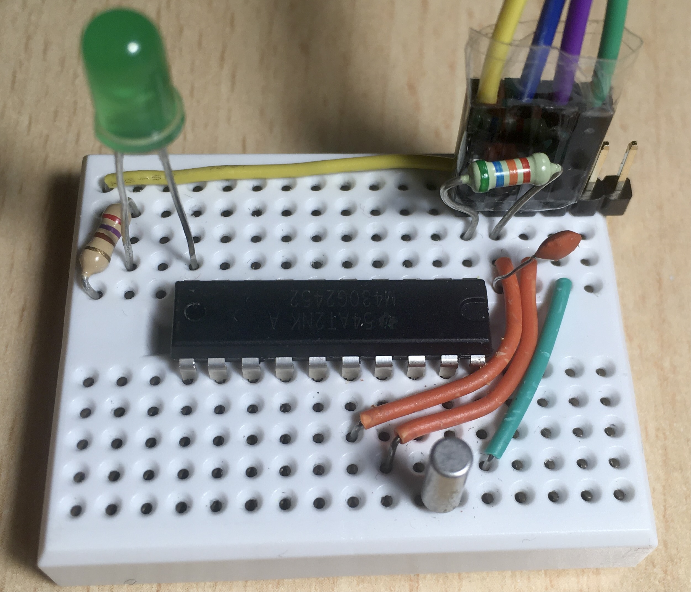
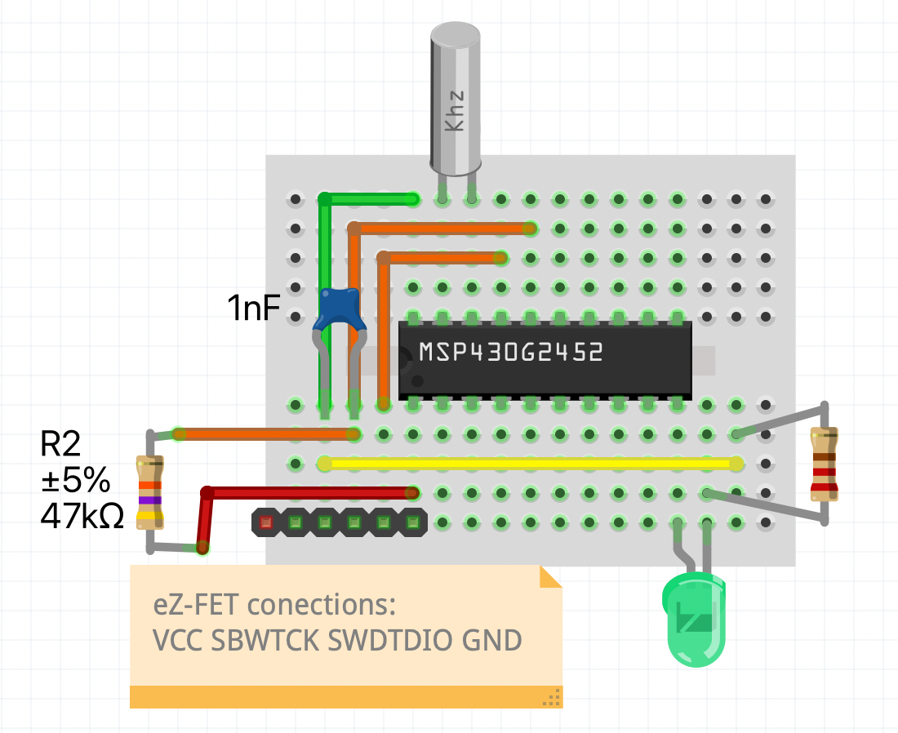

# Low Frequency External Clock

Example of how to set up a timer with an interruption (in this case to toggle a led).

I've used a external low frequency clock (32768Hz), which feeds the timer after divide de frequency two times by 8. Then, the interruption is configured to be called after 512 cycles. So the led is toggled every 1 second.

To program this MCU (msp430g2452) I've used the eZ-FET Debug Probe Rev 1.4 from my lauchpad.

## References
 * http://www.msp430launchpad.com/2012/03/using-aclk-and-32khz-crystal.html
 * https://43oh.com/2011/11/tutorial-to-use-your-launchpad-as-a-programmer/

## WARNINGS

 * The circuit must be powered at 5Volt to make the external crystal works properly

 * It's takes a few seconds to stabilize the frequency. At the beginning, just after
 * powering the circuit, it could seem that it does not work, but after a few seconds
 * the LED lights up regularly according to the configured timer.