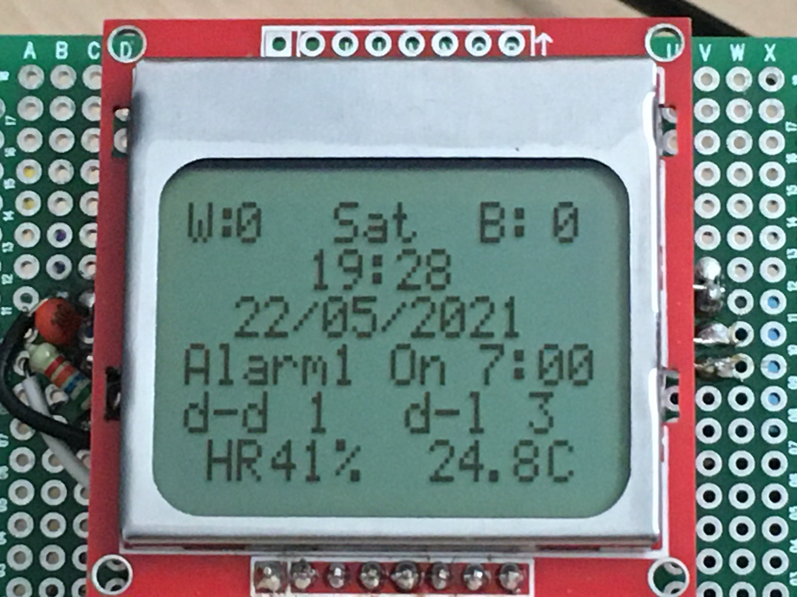
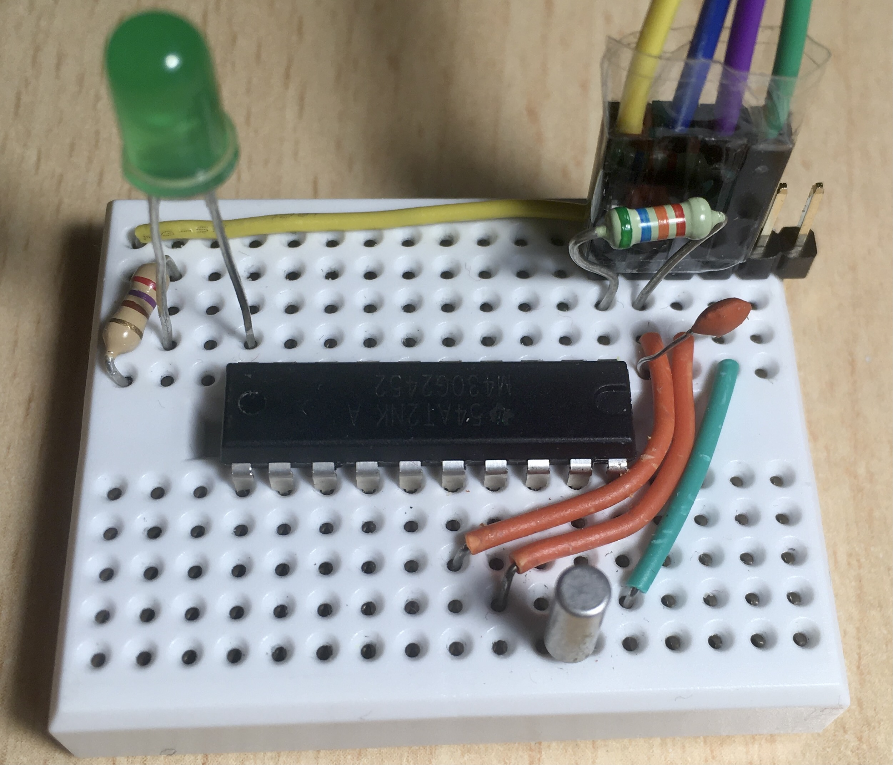

# Testing_MSP430G2
Learning and testing some modules using Launchpads from TI

## Using Make

Compiling using Command Line and make
It possible to compile projects generated in CSS using command lines. When a new CSS project is created, make files are autogenerated, which can be used, for example, to work in your favorite IDE, and compile directly from the terminal with make

__Compile:__
```
make {project_name}.out
```

### __Requirement to Flash the MCU using MSP430Flasher Command Line__

__Important:__
 * As previous step the configuration of the project on CSS has to be set to generate .txt output files.
 * You will need to install [MSP430Flasher](https://www.ti.com/tool/MSP430-FLASHER)

After a regeneration of make file, generate the .out file from the .txt compiled file
```
make {project_name}.txt
```

And now, the file can be uploaded with MSP430Flasher.

```
MSP430Flasher -w {project_name}.txt
```


### __Requirement to Flash the MCU using Mspdebug Command Line__

To burn the mcu, as long as you have a launchpad or another compatible board, the easiest way is to use __Mspdebug__:

```
brew install mspdebug
````

__To flash your mcu:__

```
mspdebug {your_programming_device} "prog {prog_project_name}.out"
```

to see the compatible programmers:

```
mspdebug --help
```
For example, to use a launchpad MSP430G2, the device is `rf2500`

# Modules/hardware tested

## 5110 Display

[Link to code](https://github.com/mafdezmoreno/Testing_MSP430G2/tree/main/lcd_5110_msp430g2)

## 5110 Display + DHT
https://github.com/mafdezmoreno/Testing_MSP430G2/tree/main/dht_5110_msp430g2

## LCD

[Link to code](https://github.com/mafdezmoreno/Testing_MSP430G2/tree/main/LCD_Test_MSP430G2454)

## Low Frequency External Clock

[Link to code](https://github.com/mafdezmoreno/Testing_MSP430G2/tree/main/Blink_32khz_Clock) 

