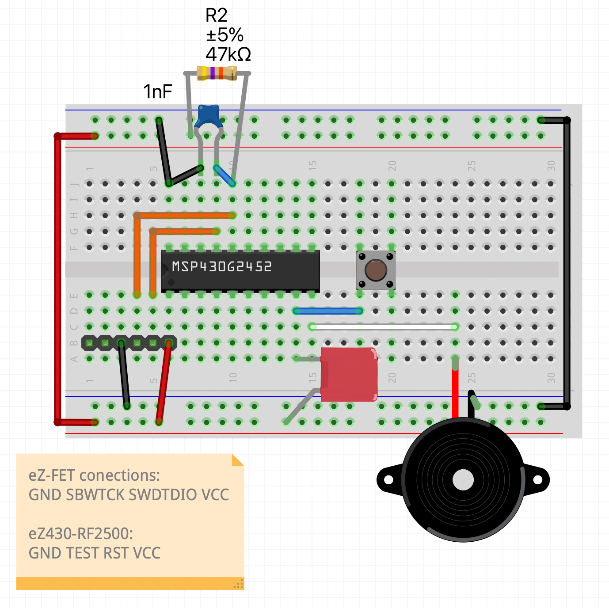

# Buzzer controled by Button an Timer

Example of how to activate and deactivate a timer controlled buzzer using a msp430 mcu.

Created to be implemented in a future alarm-clock project.

This examples allows:
1. Get correct sound of the buzzer (frequency and sound pauses).
2. Debug the activation/deactivation.
3. Implement all the hal to easy the integration in a project.
4. Optimizes the timer operation.

